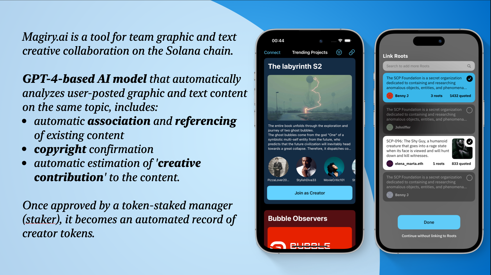

# Magiry.ai
On-chain contribution recorder for idea collaboration.
Making creative collaboration in the 'Open Studio' possible.
**Built for Solana.**
## Why Solana made Magiry possible?
- Solana is the **earliest chain** to support ChatGPT.
- Several projects related to **AI CPUs** are hosted on Solana.
- An example of such a project is the AI track sponsor, io.net, which is involved in AI computing power.
- The **scalability** on Solana is unique, enabling a high level of efficiency and effectiveness.
## What we bring to Solana?
- We provide **on-chain evidence for creative collaborations** across various scenarios, enhanced by the value of AI technology.
- Our initiative can onboard an **entirely new user base** that includes creators, creative collaborators, and producers of graphics and text.
- Our contribution to the platform makes **DAO tooling more efficient,faster, and trusted**.
- We effectively utilize Solana's highscalability and computing power.
- Our initiative contributes a **unique ecological position** in thedecentralized collaboration proofingsegment.
- We are committed to **continuousproject development** to allow AI and blockchain to be used in more everyday user collaboration scenarios.

Magiry.ai is a tool for team graphic and text creative collaboration on the Solana chain. 

GPT-4-based AI model that automatically analyzes user-posted graphic and text content on the same topic, includes: 
- automatic association and referencing of existing content
- copyright confirmation
- automatic estimation of 'creative contribution' to the content.

Once approved by a token-staked manager (staker), it becomes an automated record of creator tokens.

Super easy way for creator onboarding:

## Contact us to co-buidl
Current buidl team:
- **bL1nk^**: Full stack developer, AI algorithm, 2018 Apple WWDC Scholarship winner
- **Serin Ai**: Expert in creator economy, former Alibaba, operated 1 million+ creators, 10 million+ DAU Content App, responsible for creator live streaming e-commerce with an annual $3 billion+ GMV

